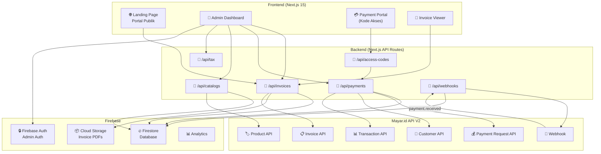
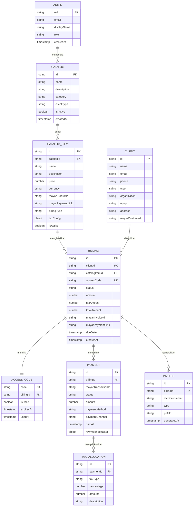
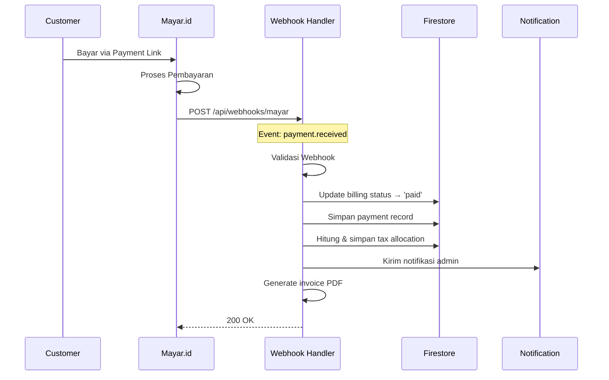
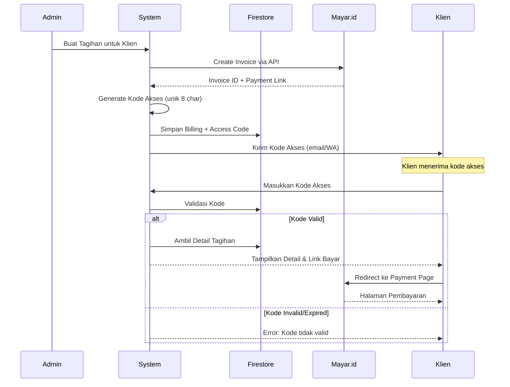
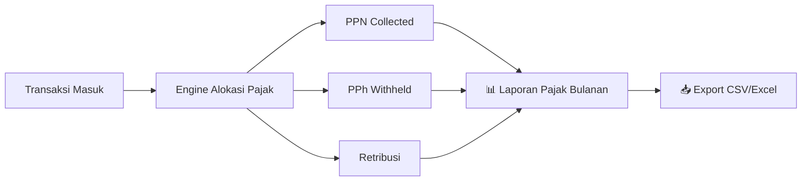
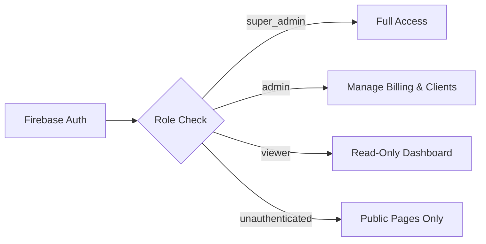
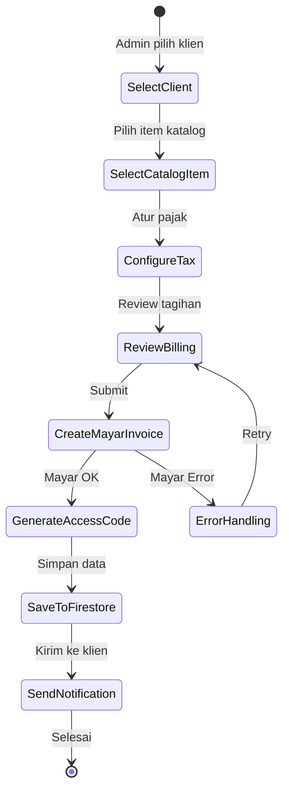
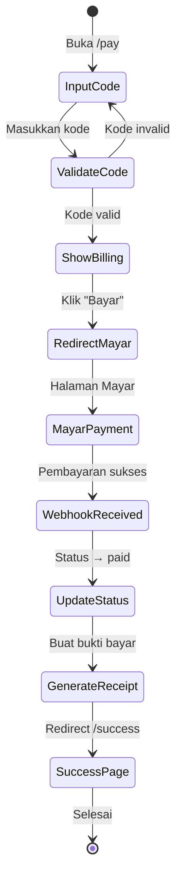

# 🏦 SOSO Creative Hub — Payment Center
## Blueprint Arsitektur Aplikasi Pembayaran Terpusat

---

> **Nama Proyek:** Payment SOSO Creative Hub  
> **Versi Blueprint:** 1.0  
> **Tanggal:** 25 September 2026  
> **Lokasi:** `D:\Project\GAWE\Payment SOSO Creative Hub`

---

## 📋 Ringkasan Eksekutif

- ✅ Sistem pembayaran terpusat menggunakan **Mayar.id API V2** sebagai payment gateway
- ✅ Portal admin untuk kelola **katalog aplikasi, tagihan, invoice, dan bukti bayar**
- ✅ Mekanisme **kode akses** bagi yang ditagihkan — tanpa perlu registrasi rumit
- ✅ Alokasi otomatis **pajak & retribusi** dari setiap transaksi
- ✅ Melayani **klien pemerintah (instansi) maupun swasta (perusahaan/individu)**
- ✅ Stack: **Next.js 15 (App Router) + Firebase + Tailwind CSS v4 + Mayar.id API V2**

---

## 1. 🎯 Visi & Tujuan Produk

### 1.1 Problem Statement
Pengelolaan pembayaran untuk berbagai aplikasi/produk yang tersebar di banyak platform menyulitkan:
- Klien kesulitan menemukan channel pembayaran yang benar
- Admin kesulitan melacak status tagihan lintas produk
- Tidak ada sistem terpusat untuk penerbitan invoice & bukti bayar
- Alokasi pajak/retribusi dilakukan manual

### 1.2 Solusi
Satu portal pembayaran terpusat (**Payment Hub**) yang:
- Menerbitkan tagihan otomatis via Mayar.id API
- Memberikan **kode akses unik** untuk setiap tagihan
- Menghasilkan invoice & bukti pembayaran resmi (PDF)
- Menghitung dan mengalokasikan pajak secara otomatis
- Dashboard admin untuk memantau seluruh transaksi

---

## 2. 🏗️ Arsitektur Sistem

### 2.1 High-Level Architecture



### 2.2 Tech Stack Detail

| Layer | Teknologi | Versi | Alasan |
|-------|-----------|-------|--------|
| **Framework** | Next.js (App Router) | 15.x | SSR/SSG, API Routes, RSC |
| **Styling** | Tailwind CSS | v4 | Diminta user, utility-first |
| **UI Components** | shadcn/ui | latest | Headless, composable |
| **Auth** | Firebase Auth | v10 | Google/Email auth untuk admin |
| **Database** | Cloud Firestore | v10 | Real-time, scalable, NoSQL |
| **Storage** | Firebase Cloud Storage | v10 | PDF invoices & receipts |
| **Payment** | Mayar.id API | V2 | Payment gateway Indonesia |
| **PDF Generator** | @react-pdf/renderer | latest | Invoice & receipt PDF |
| **State Management** | Zustand | v5 | Lightweight global state |
| **Form** | React Hook Form + Zod | latest | Validasi type-safe |
| **Charts** | Recharts | latest | Dashboard visualisasi |
| **Deployment** | Vercel | - | Native Next.js hosting |

---

## 3. 📐 Desain Database (Firestore)

### 3.1 Entity Relationship



### 3.2 Koleksi Firestore

```
/admins/{adminId}
/catalogs/{catalogId}
/catalogs/{catalogId}/items/{itemId}
/clients/{clientId}
/billings/{billingId}
/access_codes/{code}
/payments/{paymentId}
/invoices/{invoiceId}
/tax_allocations/{allocationId}
/webhook_logs/{logId}
/settings/global
/settings/tax
```

### 3.3 Struktur Dokumen Utama

#### `billings/{billingId}`
```typescript
interface Billing {
  id: string;
  billingNumber: string;          // "INV-2026-0001"
  clientId: string;
  catalogItemId: string;
  accessCode: string;             // "PAY-A3X9K2"
  
  // Amounts
  subtotal: number;
  taxDetails: TaxDetail[];
  taxTotal: number;
  grandTotal: number;
  
  // Mayar Integration
  mayarInvoiceId: string | null;
  mayarPaymentUrl: string | null;
  mayarStatus: string;
  
  // Status
  status: 'draft' | 'issued' | 'sent' | 'partially_paid' | 'paid' | 'overdue' | 'cancelled';
  
  // Dates
  issuedAt: Timestamp;
  dueDate: Timestamp;
  paidAt: Timestamp | null;
  
  // Meta
  notes: string;
  clientType: 'government' | 'private' | 'individual';
  createdBy: string;
  createdAt: Timestamp;
  updatedAt: Timestamp;
}

interface TaxDetail {
  type: 'ppn' | 'pph21' | 'pph23' | 'pph4_2' | 'retribusi' | 'custom';
  name: string;
  percentage: number;
  amount: number;
  isInclusive: boolean;  // apakah sudah termasuk dalam harga
}
```

---

## 4. 🔌 Integrasi Mayar.id API V2

### 4.1 Endpoint yang Digunakan

| Fitur | Mayar Endpoint | Method | Keterangan |
|-------|----------------|--------|------------|
| **Buat Invoice** | `/hl/v2/invoices` | POST | Penerbitan tagihan |
| **Detail Invoice** | `/hl/v2/invoices/{id}` | GET | Cek status tagihan |
| **Edit Invoice** | `/hl/v2/invoices/{id}` | PUT | Update tagihan |
| **Buat Payment Request** | `/hl/v2/reqpayment` | POST | Single payment request |
| **Buat Customer** | `/hl/v2/customers` | POST | Registrasi klien |
| **Cari Customer** | `/hl/v2/customers/search` | GET | Cari by email |
| **Buat Product** | `/hl/v2/products` | POST | Katalog produk |
| **List Transaksi Paid** | `/hl/v2/transactions/paid` | GET | Riwayat bayar |
| **Detail Transaksi** | `/hl/v2/transactions/{id}` | GET | Detail bayar |
| **Statistik Harian** | `/hl/v2/transactions/daily` | GET | Laporan harian |
| **Saldo Akun** | `/hl/v2/balance` | GET | Saldo Mayar |
| **Dynamic QR** | `/hl/v2/qrcode/dynamic` | POST | QRIS pembayaran |
| **Webhook** | Dashboard Config | - | `payment.received` |

### 4.2 Konfigurasi API

```typescript
// lib/mayar.ts
const MAYAR_CONFIG = {
  baseUrl: process.env.MAYAR_API_BASE_URL,     // https://api.mayar.id/hl/v2
  apiKey: process.env.MAYAR_API_KEY,            // Bearer token
  sandboxUrl: process.env.MAYAR_SANDBOX_URL,    // https://api.mayar.club/hl/v2
  webhookSecret: process.env.MAYAR_WEBHOOK_SECRET,
};
```

### 4.3 Flow Webhook



---

## 5. 🔐 Sistem Kode Akses

### 5.1 Flow Kode Akses



### 5.2 Format Kode Akses

```
Format: PAY-{RANDOM_6_CHARS}
Contoh: PAY-A3X9K2, PAY-M7B2F5

Rules:
- 6 karakter alfanumerik (uppercase + angka)
- Tidak mengandung karakter ambigu (0/O, 1/I/L)
- Unik per billing
- Masa berlaku: sesuai due date tagihan
- Single-use: setelah pembayaran selesai, kode mati
```

---

## 6. 💰 Sistem Alokasi Pajak

### 6.1 Jenis Pajak yang Didukung

| Kode | Nama Pajak | Rate Default | Keterangan |
|------|-----------|--------------|------------|
| `ppn` | PPN (Pajak Pertambahan Nilai) | 12% | Pajak atas barang/jasa |
| `pph21` | PPh Pasal 21 | Bervariasi | Pajak penghasilan orang pribadi |
| `pph23` | PPh Pasal 23 | 2% / 15% | Jasa, royalti, bunga |
| `pph4_2` | PPh Pasal 4 ayat 2 | Bervariasi | Pajak final |
| `retribusi` | Retribusi Daerah | Custom | Untuk klien pemerintah |
| `custom` | Pajak/Pungutan Lainnya | Custom | Konfigurasi manual |

### 6.2 Skema Alokasi

```typescript
// Contoh konfigurasi pajak per catalog item
interface TaxConfig {
  isEnabled: boolean;
  allocations: TaxAllocationRule[];
}

interface TaxAllocationRule {
  taxType: 'ppn' | 'pph21' | 'pph23' | 'pph4_2' | 'retribusi' | 'custom';
  name: string;
  percentage: number;
  isInclusive: boolean;      // termasuk dalam harga atau di-add
  appliesTo: 'government' | 'private' | 'all';
  description: string;
}

// Contoh kalkulasi
// Harga item: Rp 1.000.000
// PPN 12% (exclusive): Rp 120.000
// PPh 23 2% (inclusive, dipotong dari harga): Rp 20.000
// Total tagihan: Rp 1.100.000 (1.000.000 + 120.000 - 20.000)
```

### 6.3 Laporan Pajak



---

## 7. 🗂️ Struktur Halaman & Routing

### 7.1 Sitemap

```
/                                   → Landing page publik
/pay                                → Input kode akses pembayaran
/pay/[code]                         → Detail tagihan & tombol bayar
/pay/[code]/success                 → Halaman sukses pembayaran
/pay/[code]/receipt                 → Bukti pembayaran (viewable/printable)

/admin                              → Redirect ke /admin/dashboard
/admin/login                        → Login admin (Firebase Auth)
/admin/dashboard                    → Dashboard utama (statistik)
/admin/catalogs                     → Kelola katalog aplikasi/produk
/admin/catalogs/[id]                → Detail & edit katalog
/admin/catalogs/[id]/items          → Items dalam katalog
/admin/billings                     → Daftar semua tagihan
/admin/billings/new                 → Buat tagihan baru
/admin/billings/[id]                → Detail tagihan
/admin/billings/[id]/invoice        → Preview invoice
/admin/payments                     → Riwayat pembayaran
/admin/payments/[id]                → Detail pembayaran
/admin/clients                      → Kelola data klien
/admin/clients/new                  → Tambah klien baru
/admin/clients/[id]                 → Detail klien
/admin/tax                          → Laporan & alokasi pajak
/admin/tax/report                   → Laporan pajak periodik
/admin/settings                     → Pengaturan sistem
/admin/settings/tax                 → Konfigurasi pajak
/admin/settings/api                 → Konfigurasi API Mayar
/admin/settings/templates           → Template invoice & receipt

/api/webhooks/mayar                 → Webhook handler Mayar.id
/api/invoices                       → CRUD Invoice
/api/billings                       → CRUD Billing
/api/access-codes                   → Validasi kode akses
/api/payments                       → Payment operations
/api/tax                            → Tax calculation & reports
/api/catalogs                       → CRUD Katalog
/api/clients                        → CRUD Klien
/api/reports                        → Generate laporan
```

### 7.2 Layout Hierarchy

```
app/
├── layout.tsx                      → Root layout (fonts, metadata)
├── page.tsx                        → Landing page
├── pay/
│   ├── page.tsx                    → Input kode akses
│   └── [code]/
│       ├── page.tsx                → Detail tagihan
│       ├── success/page.tsx        → Sukses bayar
│       └── receipt/page.tsx        → Bukti bayar
├── admin/
│   ├── layout.tsx                  → Admin layout (sidebar, auth guard)
│   ├── login/page.tsx              → Login
│   ├── dashboard/page.tsx          → Dashboard
│   ├── catalogs/
│   │   ├── page.tsx                → List katalog
│   │   └── [id]/
│   │       ├── page.tsx            → Detail katalog
│   │       └── items/page.tsx      → Items
│   ├── billings/
│   │   ├── page.tsx                → List tagihan
│   │   ├── new/page.tsx            → Form tagihan baru
│   │   └── [id]/
│   │       ├── page.tsx            → Detail
│   │       └── invoice/page.tsx    → Preview
│   ├── payments/
│   │   ├── page.tsx                → List pembayaran
│   │   └── [id]/page.tsx           → Detail
│   ├── clients/
│   │   ├── page.tsx                → List klien
│   │   ├── new/page.tsx            → Form klien baru
│   │   └── [id]/page.tsx           → Detail
│   ├── tax/
│   │   ├── page.tsx                → Overview pajak
│   │   └── report/page.tsx         → Laporan periodik
│   └── settings/
│       ├── page.tsx                → General settings
│       ├── tax/page.tsx            → Tax config
│       ├── api/page.tsx            → API config
│       └── templates/page.tsx      → Templates
└── api/
    ├── webhooks/
    │   └── mayar/route.ts          → Webhook handler
    ├── invoices/route.ts
    ├── billings/route.ts
    ├── access-codes/route.ts
    ├── payments/route.ts
    ├── tax/route.ts
    ├── catalogs/route.ts
    ├── clients/route.ts
    └── reports/route.ts
```

---

## 8. 📊 Fitur Admin Dashboard

### 8.1 Dashboard Utama

```
┌─────────────────────────────────────────────────────────────────┐
│  📊 Dashboard Payment Hub                              👤 Admin │
├────────────┬────────────┬────────────┬──────────────────────────┤
│  💰 Total  │  📋 Tagihan│  ✅ Lunas  │  ⏰ Jatuh Tempo          │
│  Revenue   │  Aktif     │  Bulan Ini │  Mendekati               │
│  Rp 125jt  │  47        │  32        │  8                       │
├────────────┴────────────┴────────────┴──────────────────────────┤
│                                                                  │
│  📈 Grafik Pendapatan Bulanan (Recharts Area Chart)             │
│  ████████████████████████████████████                           │
│  █████████████████████████████                                  │
│  ████████████████████                                           │
│                                                                  │
├──────────────────────────────┬───────────────────────────────────┤
│  📋 Transaksi Terbaru       │  🏷️ Breakdown per Katalog        │
│  ─────────────────────       │  ─────────────────────            │
│  • INV-2026-0047 ✅ Paid    │  POS App     : 35% ████          │
│  • INV-2026-0046 ⏳ Pending │  Presensi    : 25% ███           │
│  • INV-2026-0045 ✅ Paid    │  Klinik App  : 20% ██            │
│  • INV-2026-0044 ❌ Overdue │  PRC App     : 15% ██            │
│  • INV-2026-0043 ✅ Paid    │  Lainnya     : 5%  █             │
└──────────────────────────────┴───────────────────────────────────┘
```

### 8.2 Fitur-Fitur Admin

| Modul | Fitur |
|-------|-------|
| **Katalog** | CRUD katalog & item produk/aplikasi, set harga & pajak, sinkron ke Mayar.id |
| **Tagihan** | Buat tagihan manual/batch, generate kode akses, kirim notifikasi, track status |
| **Pembayaran** | Lihat riwayat, detail transaksi, rekonsiliasi, export data |
| **Klien** | Kelola data klien (pemerintah/swasta), riwayat transaksi per klien |
| **Pajak** | Konfigurasi rate pajak, laporan alokasi, export untuk pelaporan |
| **Invoice** | Generate PDF, template kustom, kirim via email |
| **Receipt** | Bukti pembayaran otomatis, download/print |
| **Laporan** | Harian, bulanan, per katalog, per klien, pajak |
| **Settings** | API key Mayar, konfigurasi pajak, template, notifikasi |

---

## 9. 🎨 Desain UI/UX

### 9.1 Design System

```
Color Palette:
─────────────
Primary:    #0951EF (Mayar Blue)
Secondary:  #6366F1 (Indigo)
Success:    #10B981 (Emerald)
Warning:    #F59E0B (Amber)
Danger:     #EF4444 (Red)
Background: #0A0B10 (Dark) / #FFFFFF (Light)
Surface:    #1A1B23 (Dark) / #F8FAFC (Light)
Border:     #2A2B35 (Dark) / #E2E8F0 (Light)

Typography:
───────────
Heading:    Plus Jakarta Sans (Google Fonts)
Body:       Inter (Google Fonts)
Mono:       JetBrains Mono (code/numbers)

Spacing:    4px base unit (Tailwind default)
Radius:     12px (cards), 8px (buttons), 6px (inputs)
```

### 9.2 Tema & Mode

- **Dark Mode** (default) — Professional & modern
- **Light Mode** — Untuk keperluan cetak & presentasi
- **Glassmorphism** pada cards & panels
- **Smooth transitions** 200-300ms
- **Micro-animations** pada status badges & charts

---

## 10. 🔒 Keamanan

### 10.1 Authentication & Authorization



### 10.2 Security Measures

| Layer | Proteksi |
|-------|----------|
| **API Routes** | Firebase Admin SDK token verification |
| **Webhook** | Signature validation dari Mayar |
| **Access Codes** | Rate limiting (max 5 attempts/IP/15min) |
| **Firestore** | Security Rules per collection |
| **Environment** | Semua secrets di `.env.local` (never committed) |
| **CORS** | Whitelist domain production only |
| **CSP** | Content Security Policy headers |
| **Rate Limit** | API rate limiting via middleware |

### 10.3 Firestore Security Rules (Konsep)

```javascript
rules_version = '2';
service cloud.firestore {
  match /databases/{database}/documents {
    // Admin-only collections
    match /admins/{adminId} {
      allow read, write: if isAdmin();
    }
    
    match /catalogs/{catalogId} {
      allow read: if true;  // Publik bisa lihat katalog
      allow write: if isAdmin();
    }
    
    match /billings/{billingId} {
      allow read: if isAdmin() || isAccessCodeValid();
      allow write: if isAdmin();
    }
    
    match /payments/{paymentId} {
      allow read: if isAdmin();
      allow write: if false;  // Hanya via server (webhook)
    }
    
    // Helper functions
    function isAdmin() {
      return request.auth != null 
        && exists(/databases/$(database)/documents/admins/$(request.auth.uid));
    }
  }
}
```

---

## 11. 📁 Struktur Proyek

```
Payment SOSO Creative Hub/
├── .env.local                    # Environment variables
├── .env.example                  # Template env
├── next.config.ts                # Next.js configuration
├── tailwind.config.ts            # Tailwind v4 config
├── tsconfig.json                 # TypeScript config
├── package.json
│
├── public/
│   ├── logo.svg
│   ├── favicon.ico
│   └── images/
│
├── src/
│   ├── app/                      # App Router pages (lihat §7.2)
│   │   ├── layout.tsx
│   │   ├── page.tsx
│   │   ├── globals.css
│   │   ├── pay/
│   │   ├── admin/
│   │   └── api/
│   │
│   ├── components/
│   │   ├── ui/                   # shadcn/ui components
│   │   │   ├── button.tsx
│   │   │   ├── card.tsx
│   │   │   ├── dialog.tsx
│   │   │   ├── input.tsx
│   │   │   ├── table.tsx
│   │   │   ├── badge.tsx
│   │   │   └── ...
│   │   ├── layout/
│   │   │   ├── AdminSidebar.tsx
│   │   │   ├── AdminHeader.tsx
│   │   │   └── Footer.tsx
│   │   ├── billing/
│   │   │   ├── BillingForm.tsx
│   │   │   ├── BillingTable.tsx
│   │   │   ├── BillingStatusBadge.tsx
│   │   │   └── AccessCodeCard.tsx
│   │   ├── payment/
│   │   │   ├── AccessCodeInput.tsx
│   │   │   ├── PaymentDetail.tsx
│   │   │   └── PaymentReceipt.tsx
│   │   ├── invoice/
│   │   │   ├── InvoicePreview.tsx
│   │   │   ├── InvoicePDF.tsx
│   │   │   └── ReceiptPDF.tsx
│   │   ├── catalog/
│   │   │   ├── CatalogCard.tsx
│   │   │   ├── CatalogItemForm.tsx
│   │   │   └── CatalogGrid.tsx
│   │   ├── dashboard/
│   │   │   ├── StatsCards.tsx
│   │   │   ├── RevenueChart.tsx
│   │   │   ├── RecentTransactions.tsx
│   │   │   └── CatalogBreakdown.tsx
│   │   └── tax/
│   │       ├── TaxConfigForm.tsx
│   │       ├── TaxReportTable.tsx
│   │       └── TaxSummaryCard.tsx
│   │
│   ├── lib/
│   │   ├── firebase/
│   │   │   ├── config.ts          # Firebase client config
│   │   │   ├── admin.ts           # Firebase Admin SDK
│   │   │   ├── auth.ts            # Auth helpers
│   │   │   └── firestore.ts       # Firestore helpers
│   │   ├── mayar/
│   │   │   ├── client.ts          # Mayar API client class
│   │   │   ├── types.ts           # Mayar API types
│   │   │   ├── invoice.ts         # Invoice operations
│   │   │   ├── payment.ts         # Payment operations
│   │   │   ├── customer.ts        # Customer operations
│   │   │   └── webhook.ts         # Webhook handler & validation
│   │   ├── tax/
│   │   │   ├── calculator.ts      # Tax calculation engine
│   │   │   ├── allocator.ts       # Tax allocation logic
│   │   │   └── types.ts           # Tax types
│   │   ├── pdf/
│   │   │   ├── invoice-template.tsx
│   │   │   └── receipt-template.tsx
│   │   ├── utils/
│   │   │   ├── access-code.ts     # Generate & validate codes
│   │   │   ├── currency.ts        # Format Rupiah
│   │   │   ├── date.ts            # Date formatting
│   │   │   └── invoice-number.ts  # Sequential numbering
│   │   └── validations/
│   │       ├── billing.ts         # Zod schemas
│   │       ├── client.ts
│   │       └── catalog.ts
│   │
│   ├── hooks/
│   │   ├── useAuth.ts
│   │   ├── useBillings.ts
│   │   ├── usePayments.ts
│   │   ├── useCatalogs.ts
│   │   └── useRealtimeUpdates.ts
│   │
│   ├── stores/
│   │   ├── authStore.ts           # Zustand auth store
│   │   └── uiStore.ts             # UI state (sidebar, theme)
│   │
│   ├── types/
│   │   ├── billing.ts
│   │   ├── catalog.ts
│   │   ├── client.ts
│   │   ├── payment.ts
│   │   ├── tax.ts
│   │   └── index.ts
│   │
│   └── middleware.ts              # Auth middleware for admin routes
│
├── firestore.rules
├── firestore.indexes.json
├── firebase.json
└── README.md
```

---

## 12. 🔄 Flow Utama Aplikasi

### 12.1 Flow Penerbitan Tagihan (Admin)



### 12.2 Flow Pembayaran (Klien)



---

## 13. 🌐 Environment Variables

```bash
# .env.local

# ─── Next.js ───
NEXT_PUBLIC_APP_URL=https://payment.sosocreativehub.com
NEXT_PUBLIC_APP_NAME="SOSO Creative Hub - Payment Center"

# ─── Firebase Client ───
NEXT_PUBLIC_FIREBASE_API_KEY=
NEXT_PUBLIC_FIREBASE_AUTH_DOMAIN=
NEXT_PUBLIC_FIREBASE_PROJECT_ID=
NEXT_PUBLIC_FIREBASE_STORAGE_BUCKET=
NEXT_PUBLIC_FIREBASE_MESSAGING_SENDER_ID=
NEXT_PUBLIC_FIREBASE_APP_ID=

# ─── Firebase Admin ───
FIREBASE_ADMIN_PROJECT_ID=
FIREBASE_ADMIN_CLIENT_EMAIL=
FIREBASE_ADMIN_PRIVATE_KEY=

# ─── Mayar.id API V2 ───
MAYAR_API_BASE_URL=https://api.mayar.id/hl/v2
MAYAR_API_KEY=
MAYAR_WEBHOOK_SECRET=
MAYAR_SANDBOX_URL=https://api.mayar.club/hl/v2
MAYAR_USE_SANDBOX=false

# ─── Tax Config ───
DEFAULT_PPN_RATE=12
DEFAULT_PPH23_RATE=2
```

---

## 14. 📦 Dependencies

```json
{
  "dependencies": {
    "next": "^15.0.0",
    "react": "^19.0.0",
    "react-dom": "^19.0.0",
    
    "firebase": "^10.14.0",
    "firebase-admin": "^12.6.0",
    
    "tailwindcss": "^4.0.0",
    "@tailwindcss/postcss": "^4.0.0",
    
    "zustand": "^5.0.0",
    "react-hook-form": "^7.53.0",
    "@hookform/resolvers": "^3.9.0",
    "zod": "^3.23.0",
    
    "@react-pdf/renderer": "^4.0.0",
    "recharts": "^2.13.0",
    
    "date-fns": "^4.1.0",
    "lucide-react": "^0.453.0",
    "clsx": "^2.1.0",
    "tailwind-merge": "^2.6.0",
    
    "nanoid": "^5.0.0"
  },
  "devDependencies": {
    "typescript": "^5.6.0",
    "@types/react": "^19.0.0",
    "@types/node": "^22.0.0",
    "eslint": "^9.0.0",
    "eslint-config-next": "^15.0.0"
  }
}
```

---

## 15. 🚀 Tahapan Pengembangan

### Phase 1 — Foundation (Minggu 1-2)
| # | Task | Prioritas |
|---|------|-----------|
| 1 | Setup Next.js 15 + Tailwind v4 + TypeScript | 🔴 High |
| 2 | Setup Firebase (Auth, Firestore, Storage) | 🔴 High |
| 3 | Integrasi Mayar.id API Client | 🔴 High |
| 4 | Design system & UI components (shadcn/ui) | 🔴 High |
| 5 | Admin auth flow (login/logout) | 🔴 High |

### Phase 2 — Core Features (Minggu 3-4)
| # | Task | Prioritas |
|---|------|-----------|
| 6 | CRUD Katalog & Items | 🔴 High |
| 7 | CRUD Klien (gov/private) | 🔴 High |
| 8 | Penerbitan Tagihan + Generate Access Code | 🔴 High |
| 9 | Portal Pembayaran (input kode akses → payment) | 🔴 High |
| 10 | Webhook handler Mayar.id | 🔴 High |

### Phase 3 — Billing & Invoice (Minggu 5-6)
| # | Task | Prioritas |
|---|------|-----------|
| 11 | Generate Invoice PDF | 🟡 Medium |
| 12 | Generate Bukti Pembayaran PDF | 🟡 Medium |
| 13 | Tax calculation engine | 🟡 Medium |
| 14 | Tax allocation per transaksi | 🟡 Medium |
| 15 | Status tracking & notifikasi | 🟡 Medium |

### Phase 4 — Dashboard & Reports (Minggu 7-8)
| # | Task | Prioritas |
|---|------|-----------|
| 16 | Admin dashboard (statistik, charts) | 🟡 Medium |
| 17 | Laporan transaksi (harian/bulanan) | 🟡 Medium |
| 18 | Laporan pajak periodik | 🟡 Medium |
| 19 | Export data (CSV/Excel) | 🟢 Low |
| 20 | Riwayat & audit trail | 🟢 Low |

### Phase 5 — Polish & Deploy (Minggu 9-10)
| # | Task | Prioritas |
|---|------|-----------|
| 21 | Dark/Light mode & responsive | 🟡 Medium |
| 22 | Error handling & edge cases | 🔴 High |
| 23 | Security hardening | 🔴 High |
| 24 | Testing (unit + integration) | 🟡 Medium |
| 25 | Deploy ke Vercel + domain setup | 🔴 High |

---

## 16. 📌 Catatan Penting

### ⚠️ Mayar.id API V2 Migration
> **API V1 akan deprecated 1 Oktober 2026.** Blueprint ini sudah menggunakan V2 endpoints (`/hl/v2/`). Pastikan semua integrasi menggunakan V2.

### ⚠️ Webhook sebagai Source of Truth
> Jangan pernah mengandalkan redirect browser sebagai konfirmasi pembayaran. **Webhook `payment.received`** adalah satu-satunya sumber kebenaran status transaksi.

### ⚠️ Alokasi Pajak
> Fitur alokasi pajak bersifat **pencatatan internal** — tidak terintegrasi langsung dengan DJP atau sistem pajak pemerintah. Untuk pelaporan resmi, data export perlu diinput manual ke e-SPT/e-Faktur.

### ⚠️ Sandbox untuk Development
> Gunakan Mayar Sandbox (`https://api.mayar.club/hl/v2`) selama development. Switch ke production saat deploy.

### ⚠️ Kode Akses ≠ Invoice Number
> Kode akses (`PAY-XXXXXX`) adalah mekanisme akses klien ke portal bayar. Invoice number (`INV-2026-XXXX`) adalah nomor dokumen resmi untuk administrasi.

---

## 17. 📊 Estimasi & Skalabilitas

| Metrik | Kapasitas |
|--------|-----------|
| **Concurrent Users** | ~500 (Firestore tier) |
| **Billing Records** | Unlimited (Firestore) |
| **Monthly Transactions** | Sesuai limit Mayar.id |
| **API Rate Limit (Mayar)** | Rate limit per minute (lihat Mayar docs) |
| **PDF Storage** | 5GB free tier Firebase |
| **Estimated Cost** | ~$0-25/bulan (Firebase Spark/Blaze) |

---

> **Blueprint ini siap dijadikan acuan pengembangan.** Setelah disetujui, kita bisa mulai dari **Phase 1: Foundation** — setup project, konfigurasi Firebase, dan integrasi awal Mayar.id API.
